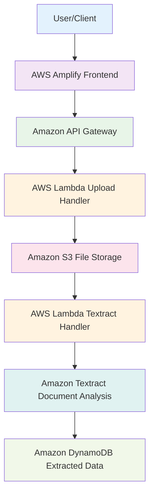
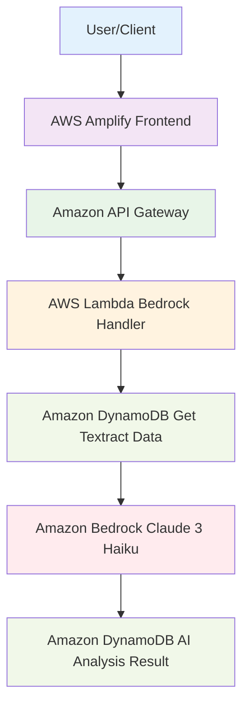

+++
title = "Document AI"
date = 2024-05-14T00:38:32+07:00
weight = 5
chapter = false
pre = "<b>5. </b>"
+++

In this section, we will explore the roles of Amazon Textract and Amazon Bedrock in a serverless invoice processing system, along with how Guardrails protect sensitive information.

## Architecture Overview

The Document AI system includes the following key components:
- **Amazon S3**: Storage for input invoices and processing results
- **AWS Lambda**: Orchestrates the serverless processing workflow
- **Amazon Textract**: Extracts data from invoices
- **Amazon Bedrock**: Intelligent analysis and information processing

## Role of Amazon Textract

### Core Functions
Amazon Textract is a fully managed machine learning service specialized for:

**1. Text and Structured Data Extraction**
- Recognizes and extracts text from images and PDFs
- Detects structured data fields such as tables and forms
- Maintains the format and layout of original documents

**2. Invoice and Receipt Analysis (Analyze Expense)**
- Automatically identifies key fields:
  - Vendor Name
  - Invoice Date
  - Total Amount
  - Tax Amount
  - Line Items details
- Extracts information with high confidence scores
- Supports various invoice formats

**3. Batch and Real-time Processing**
- Synchronous processing for small documents (< 5MB)
- Asynchronous processing for large documents and batch processing
- Direct integration with S3 for automated processing

### Benefits in the System
- **High Accuracy**: Uses deep learning models trained on millions of documents
- **No Training Required**: Pre-trained models ready to use
- **Scalable**: Automatically scales with workload
- **Cost-effective**: Pay only for what you use

## Role of Amazon Bedrock

### Core Functions
Amazon Bedrock provides a platform to access foundation models through APIs:

**1. Claude 3 Haiku - Selected Model**
- **High Speed**: Fast response times, suitable for real-time processing
- **Cost-effective**: Low cost for high volume processing
- **Efficient**: Excellent performance for analysis and summarization tasks
- **Multilingual**: Supports Vietnamese and many other languages

**2. Intelligent Analysis**
- **Data Verification**: Validates accuracy of numerical values
- **Automatic Classification**: Categorizes invoices by goods/services type
- **Anomaly Detection**: Identifies unreasonable values
- **Information Summarization**: Creates meaningful summaries from raw data

**3. Natural Language Processing**
- Understands context and meaning of information
- Answers questions about invoice content
- Generates insights and recommendations
- Formats output as required (JSON, text, etc.)

### Benefits in the System
- **Serverless**: No infrastructure management required
- **Managed Service**: AWS handles model updates and maintenance
- **High Availability**: High SLA for production workloads
- **Integration**: Easy integration with other AWS services

### Applications in Invoice Processing
- **Financial Information Protection**: Prevents exposure of account numbers and payment information
- **Regulatory Compliance**: Ensures compliance with regulations
- **Data Privacy**: Protects customer and vendor information
- **Quality Control**: Ensures quality and appropriate output

## Amazon Textract Workflow

## Amazon Bedrock Workflow

## Benefits of Serverless Architecture

**1. Scalability**
- Automatically scales with demand
- Processes from a few invoices to thousands per second
- No capacity planning required

**2. Cost Optimization**
- Pay-per-use model
- No idle resources
- Automatic resource management

**3. Reliability**
- Built-in fault tolerance
- Automatic retries and error handling
- Multi-AZ deployment

**4. Maintenance**
- Minimal operational overhead
- Automatic updates and patches
- Focus on business logic

## Reference Documentation

- [Amazon Textract Documentation](https://docs.aws.amazon.com/textract/)
- [Amazon Bedrock User Guide](https://docs.aws.amazon.com/bedrock/latest/userguide/)
- [Claude 3 Haiku Model Guide](https://docs.aws.amazon.com/bedrock/latest/userguide/model-parameters-anthropic-claude-3.html)

---

## Continue to

[6. Lambda Functions](../6-lambda/)